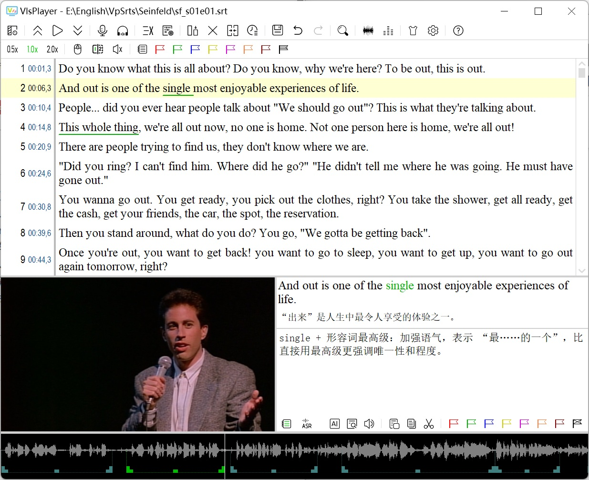
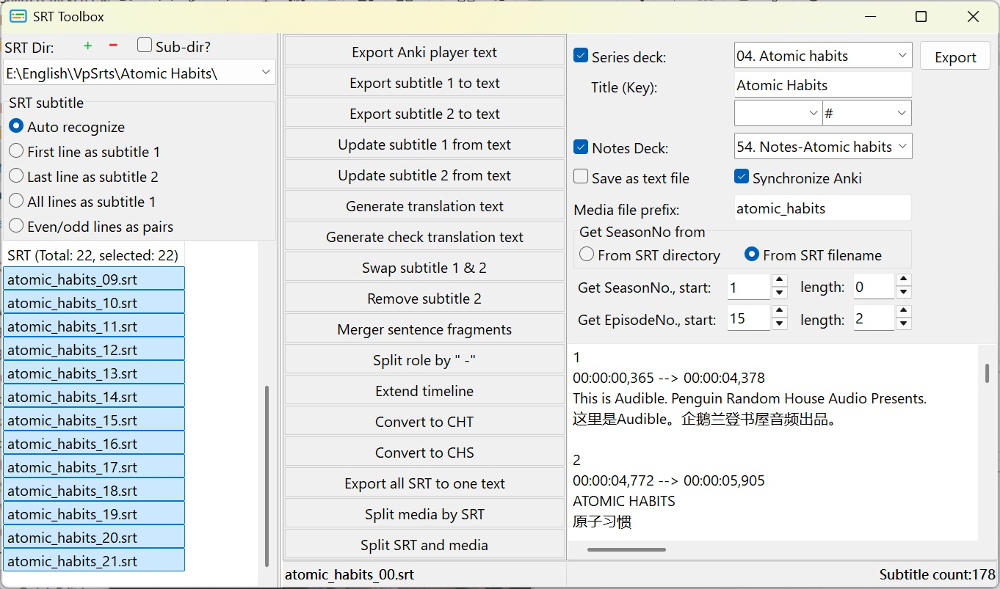
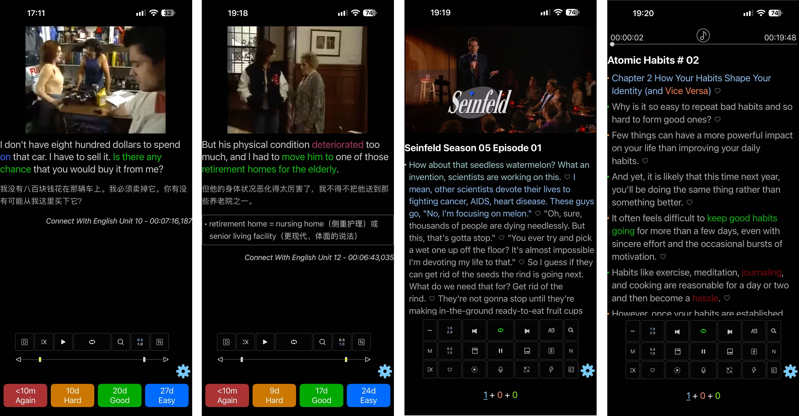

# VlsPlayer

**[English](#english) · [简体中文](#简体中文)**

---

<a id="english"></a>
## English

> A video subtitle player built for language learning.

[](LICENSE)
[]()
[](https://github.com/你的用户名/VlsPlayer/releases)

### ✨ Features

- 🎬 **Audio & Video Playback** — Built-in MPV / VLC engines, switchable on the fly
- 📝 **Subtitle Editing & Proofreading** — SRT grid editing, batch operations, Anki export
- 🎯 **ASR** — Powered by NVIDIA Parakeet-TDT-0.6B-V2; auto-generate subtitles and re-align timelines
- 🌊 **Waveform Visualization** — Intuitive timeline positioning; drag to select playback ranges
- 🔁 **Multiple Playback Modes** — Single sentence, role-play dialogue, loop selection, variable speed
- 🎙️ **Shadowing & Recording** — Record your own voice and compare with the original
- 📓 **Notes & Tags** — 7-color tags; filter by tag or note anytime
- 🤖 **AI Assist** — One-click sentence analysis and translation

### 📸 Screenshots






### ⬇️ Download

Download the latest release from the [Releases page](https://github.com/你的用户名/VlsPlayer/releases):

| File | Description |
|------|-------------|
| `VlsPlayer-vX.Y.Z-Win64.zip` | Main program (extract and run) |
| `VlsPlayer-vX.Y.Z-Win32.zip` | 32-bit version (small/medium ASR models only) |

**Unzip and double-click `VlsPlayer.exe` — no installation required.**

### 📦 ASR Models

Model files are large and **not bundled** in the main package. On first use of ASR, the program shows the download links:

- [sherpa-onnx-nemo-parakeet-tdt-0.6b-v2-fp16](https://github.com/k2-fsa/sherpa-onnx/releases/download/asr-models/sherpa-onnx-nemo-parakeet-tdt-0.6b-v2-fp16.tar.bz2) — Recommended, highest accuracy
- [sherpa-onnx-nemo-parakeet_tdt_ctc_110m-en-36000](https://github.com/k2-fsa/sherpa-onnx/releases/download/asr-models/sherpa-onnx-nemo-parakeet_tdt_ctc_110m-en-36000.tar.bz2)
- [sherpa-onnx-nemo-parakeet_tdt_ctc_110m-en-36000-int8](https://github.com/k2-fsa/sherpa-onnx/releases/download/asr-models/sherpa-onnx-nemo-parakeet_tdt_ctc_110m-en-36000-int8.tar.bz2) — Smallest, fastest

After downloading, **extract the whole folder into the `sherpa\` directory**:

```
VlsPlayer\
  └─ sherpa\
       └─ sherpa-onnx-nemo-parakeet-tdt-0.6b-v2-fp16\
            ├─ encoder.fp16.onnx
            ├─ decoder.fp16.onnx
            ├─ joiner.fp16.onnx
            └─ tokens.txt
```

### 🚀 Quick Start

1. Prepare a **video file** and a **same-named SRT subtitle file** (e.g. `Friends_S01E01.mp4` + `Friends_S01E01.srt`)
2. Unzip the program and double-click `VlsPlayer.exe`
3. Move the mouse to the left edge to reveal the file list, add the folder containing your SRT, then click the SRT file
4. For high-quality subtitles, use the **ASR Toolbox** to generate SRT automatically

See **Help → User Guide** (`VlsPlayer.html`) inside the program for details.

### 💻 Requirements

- Windows 7 / 10 / 11 (64-bit recommended)

### 🧩 What You Need to Prepare

Everything else is bundled in the release package. You only need to prepare the following, and only if you want to use the ASR features:

| Item | Purpose | Where to get |
|------|---------|--------------|
| **ASR model** | Speech recognition | See [ASR Models](#-asr-models) above |
| **Python 3.8+** | Runtime for the ASR bridge | [python.org](https://www.python.org/downloads/) |
| `numpy`, `websockets` | Python modules | `pip install numpy websockets` |

If you don't need ASR, just unzip and run — nothing else required.

### ❓ FAQ

**Q: "Missing ASR model" is shown.**
A: Download from the links above and extract into the `sherpa\` folder.

**Q: In single-sentence mode, audio and position are out of sync.**
A: Bluetooth headphones introduce latency. Use wired headphones, or fine-tune the offset in Settings (Anki).

**Q: Waveform generation is slow.**
A: The first time an SRT is opened it takes a few seconds; afterwards it is cached.

### 📄 License

This software is released under the [MIT License](LICENSE).
Third-party components and their licenses are listed in
[`THIRD-PARTY-NOTICES.txt`](THIRD-PARTY-NOTICES.txt).

### 📬 Contact

- Email: zhangzixin.ssp@gmail.com

### 🙏 Credits

This project bundles and/or depends on the following third-party components. Sincere thanks to their authors:

- **Playback engines** — [MPV / libmpv](https://mpv.io/) (LGPL/GPL), [VLC / libvlc](https://www.videolan.org/) (LGPL/GPL), [BASS](https://www.un4seen.com/) (Un4seen)
- **ASR** — [sherpa-onnx](https://github.com/k2-fsa/sherpa-onnx) (Apache-2.0); NVIDIA Parakeet-TDT-0.6B-V2 model
- **Media** — [FFmpeg](https://ffmpeg.org/) (LGPL/GPL)
- **Delphi** — TDiff by Angus Johnson

Full third-party license texts are in [`THIRD-PARTY-NOTICES.txt`](THIRD-PARTY-NOTICES.txt).

**[↑ 返回顶部 / Back to top](#vlsplayer)**

---

<a id="简体中文"></a>
## 简体中文

> 一款专为语言学习设计的视频字幕播放器。

[](LICENSE)
[]()
[](https://github.com/你的用户名/VlsPlayer/releases)

### ✨ 功能亮点

- 🎬 **音视频播放**：内置 MPV / VLC 双引擎，可随时切换
- 📝 **字幕编辑与校对**：SRT 表格编辑、批量操作、Anki 导出
- 🎯 **ASR 自动识别**：基于 NVIDIA Parakeet-TDT-0.6B-V2，自动生成字幕、自动校正时间轴
- 🌊 **波形可视化**：直观定位句子时间轴，拖拽选段播放
- 🔁 **多种播放模式**：单句、角色对话、选区循环、变速
- 🎙️ **跟读与录音**：录制发音，对比原声
- 📓 **笔记与标记**：7 色标记，随时按标签/笔记筛选
- 🤖 **AI 辅助**：一键分析句子、翻译

### 📸 截图


### ⬇️ 下载

从 [Releases 页面](https://github.com/你的用户名/VlsPlayer/releases) 下载最新版本：

| 文件 | 说明 |
|------|------|
| `VlsPlayer-vX.Y.Z-Win64.zip` | 主程序（解压即用） |
| `VlsPlayer-vX.Y.Z-Win32.zip` | 32 位版本（仅支持中小 ASR 模型） |

**解压后双击 `VlsPlayer.exe` 即可运行，无需安装。**

### 📦 ASR 模型下载

由于模型文件较大，**不包含在主程序压缩包中**。首次使用 ASR 功能时，程序会提示下载地址：

- [sherpa-onnx-nemo-parakeet-tdt-0.6b-v2-fp16](https://github.com/k2-fsa/sherpa-onnx/releases/download/asr-models/sherpa-onnx-nemo-parakeet-tdt-0.6b-v2-fp16.tar.bz2) —— 推荐，精度最高
- [sherpa-onnx-nemo-parakeet_tdt_ctc_110m-en-36000](https://github.com/k2-fsa/sherpa-onnx/releases/download/asr-models/sherpa-onnx-nemo-parakeet_tdt_ctc_110m-en-36000.tar.bz2)
- [sherpa-onnx-nemo-parakeet_tdt_ctc_110m-en-36000-int8](https://github.com/k2-fsa/sherpa-onnx/releases/download/asr-models/sherpa-onnx-nemo-parakeet_tdt_ctc_110m-en-36000-int8.tar.bz2) —— 最小，速度快

**下载后解压整个文件夹到 `sherpa\` 目录下**：

```
VlsPlayer\
  └─ sherpa\
       └─ sherpa-onnx-nemo-parakeet-tdt-0.6b-v2-fp16\
            ├─ encoder.fp16.onnx
            ├─ decoder.fp16.onnx
            ├─ joiner.fp16.onnx
            └─ tokens.txt
```

### 🚀 快速上手

1. 准备一个 **视频文件** 和 **同名的 SRT 字幕文件**（如 `Friends_S01E01.mp4` + `Friends_S01E01.srt`）
2. 解压程序，双击 `VlsPlayer.exe`
3. 鼠标移到左侧边缘，显示文件列表，添加 SRT 所在文件夹，然后点击 SRT 文件
4. 若需要高质量字幕：用 **ASR 工具箱** 自动生成 SRT

详细说明见程序内置的 **帮助 → 使用说明**（`VlsPlayer.html`）。

### 💻 系统要求

- Windows 7 / 10 / 11（64 位推荐）

### 🧩 你需要自行准备的东西

其它所有组件均已包含在发布包中。**只有需要使用 ASR 功能时**，才需要准备以下两项：

| 项目 | 用途 | 获取方式 |
|------|------|----------|
| **ASR 模型** | 语音识别 | 见上方 [ASR 模型下载](#-asr-模型下载) |
| **Python 3.8+** | ASR 桥接运行环境 | [python.org](https://www.python.org/downloads/) |
| `numpy`、`websockets` | Python 模块 | `pip install numpy websockets` |

**不需要 ASR 功能的话，解压即用，无需任何额外准备。**

### ❓ 常见问题

**Q：提示缺少 ASR 模型？**
A：从上方"ASR 模型下载"链接下载，解压到 `sherpa\` 目录。

**Q：单句模式声音和位置对不上？**
A：蓝牙耳机有延迟，建议用有线耳机，或在设置中微调偏移（Anki）。

**Q：波形生成很慢？**
A：首次打开 SRT 需要几秒，之后会缓存。

### 📄 许可

本软件采用 [MIT 许可](LICENSE) 发布。
第三方组件及其许可详见 [`THIRD-PARTY-NOTICES.txt`](THIRD-PARTY-NOTICES.txt)。

### 📬 联系

- Email: zhangzixin.ssp@gmail.com

### 🙏 致谢

本项目打包或依赖以下第三方组件，谨向作者致以诚挚的感谢：

- **播放引擎** —— [MPV / libmpv](https://mpv.io/)（LGPL/GPL）、[VLC / libvlc](https://www.videolan.org/)（LGPL/GPL）、[BASS](https://www.un4seen.com/)（Un4seen）
- **语音识别** —— [sherpa-onnx](https://github.com/k2-fsa/sherpa-onnx)（Apache-2.0）；NVIDIA Parakeet-TDT-0.6B-V2 模型
- **媒体处理** —— [FFmpeg](https://ffmpeg.org/)（LGPL/GPL）
- **Delphi 组件** —— TDiff，作者 Angus Johnson

完整的第三方许可文本见 [`THIRD-PARTY-NOTICES.txt`](THIRD-PARTY-NOTICES.txt)。

**[↑ 返回顶部 / Back to top](#vlsplayer)**
